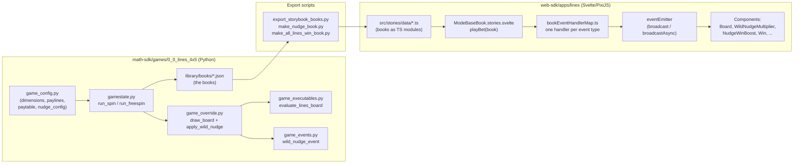

# Lines 4x5 Game — Full Architecture & Change Map

This document explains how every file we created or changed is connected, across both halves of the project:

- **`math-sdk/`** — Python engine. Simulates every possible game round ahead of time and writes them out as JSON "books". This is the *source of truth* for all game logic and money amounts.
- **`web-sdk/`** — Svelte 5 + PixiJS frontend. Never computes outcomes. It receives a book (a list of `events`) and *performs* it: spins reels, plays animations, shows win amounts.

The two halves only talk through one contract: **the book event JSON**. Everything below is organized around that contract.

---

## 1. The big picture



A round is a **book**:

```json
{
  "id": 1,
  "payoutMultiplier": 1600,
  "events": [
    { "index": 0, "type": "reveal",    "board": [...], ... },
    { "index": 1, "type": "wildNudge", "reel": 1, "nudges": 3, "multiplier": 4, "finalReel": [...] },
    { "index": 2, "type": "winInfo",   "wins": [...], ... },
    { "index": 3, "type": "setWin",    "amount": 1600, "winLevel": 4 },
    { "index": 4, "type": "setTotalWin", "amount": 1600 },
    { "index": 5, "type": "finalWin",  "amount": 1600 }
  ]
}
```

The frontend plays `events` in order. Each `type` maps to exactly one handler function in `bookEventHandlerMap.ts`.

---

## 2. Math SDK side (`math-sdk/games/0_0_lines_4x5/`)

### 2.1 Class hierarchy

Each game is a stack of classes, one per file, each inheriting from the previous:

```text
src/state/state.py + src/calculations/board.py   (engine base: GeneralGameState, Board)
        ▲
game_calculations.py   GameCalculations  — empty passthrough, place for custom math
        ▲
game_executables.py    GameExecutables   — evaluate_lines_board()
        ▲
game_override.py       GameStateOverride — draw_board(), apply_wild_nudge(), reset_book(), ...
        ▲
gamestate.py           GameState         — run_spin(), run_freespin()  (the round scripts)
```

So when `run_spin()` calls `self.draw_board()`, Python resolves it to **our override** in `game_override.py`, which itself calls the engine's `draw_board` via `super()`.

### 2.2 `game_config.py` — all the numbers

| Variable | Value | Who consumes it |
|---|---|---|
| `game_id` | `"0_0_lines_4x5"` | file paths, RGS config; mirrored by `config.ts` `gameID` in the frontend |
| `num_reels` | `5` | board drawing, `Lines.get_lines`, frontend `numReels` |
| `num_rows` | `[4,4,4,4,4]` | board drawing; frontend `numRows` and `INITIAL_BOARD` height |
| `paytable` | `{(kind, symbol): payout}` | `Lines.get_lines` looks up wins here |
| `paylines` | 50 entries, `{lineIndex: [row per reel]}` | `Lines.get_lines` iterates these; duplicated in frontend `config.ts` so the win-line overlay can draw them |
| `special_symbols` | `{"wild": ["W"], "scatter": ["S"], "multiplier": ["W"]}` | symbol attribute flags; also becomes the attribute whitelist in `json_ready_sym` (that's why `wild: true` / `multiplier: 4` appear in book JSON) |
| **`nudge_config`** (new) | `probability` per gametype (5% base / 12% free), `allowed_reels` `[1,2,3]`, `nudge_weights` `{1:50, 2:30, 3:20}` | read exclusively by `apply_wild_nudge()` in `game_override.py` |
| `freespin_triggers` | scatters → spins | `check_fs_condition()` |
| `bet_modes` / `Distribution`s | criteria ("wincap", "freegame", "0", "basegame") with quotas & conditions | drives simulation targeting; `apply_wild_nudge` reads `get_win_criteria()` from here to *skip nudges on forced-zero-win sims* |

### 2.3 `gamestate.py` — the round script

```python
run_spin():
    reset_book()            # fresh Book, resets nudge_info (our override)
    draw_board()            # our override: draw + maybe nudge + emit reveal/wildNudge
    evaluate_lines_board()  # pay the board (game_executables.py)
    if check_fs_condition(): run_freespin_from_base()
    evaluate_finalwin(); check_repeat()
```

`run_freespin()` loops `draw_board()` + `evaluate_lines_board()` per free spin — which is why the nudge feature works in free spins automatically.

### 2.4 `game_override.py` — where the nudge lives

- **`reset_book()`** — calls engine reset, then `self.nudge_info = None`. `nudge_info` is the only new piece of state; it carries `{reel, nudges, multiplier}` from board drawing to event emission.

- **`assign_special_sym_function()`** — engine hook: whenever `create_symbol("W")` is called anywhere, `assign_mult_property` runs and gives the wild a `multiplier` attribute (1 in base game, weighted random in free game). Our nudge wilds *overwrite* this attribute afterwards.

- **`draw_board(emit_event, trigger_symbol)`** (override) — calls the engine's `draw_board` from `src/calculations/board.py` with `emit_event=False` (so the reveal is *not* emitted yet — we may need to doctor the board first), then hands off to `apply_wild_nudge(emit_event)`.

- **`apply_wild_nudge(emit_event)`** — the feature, in four steps:
  1. **Roll**: `random.random() < nudge_config["probability"][gametype]`. Skipped when the distribution's `win_criteria == 0` (zero-win sims must stay zero-win) and when every `allowed_reel` holds a scatter (nudging over a scatter would break free-spin triggers). If not triggered → just emit the normal `reveal_event` and return.
  2. **Pick**: reel from `allowed_reels` (minus scatter reels), `nudges` from `nudge_weights` via `get_random_outcome`, `multiplier = 1 + nudges`.
  3. **Misaligned reveal**: rows `0 .. rows-nudges-1` of the chosen reel become `W`, and `top_symbols[reel]` (the visible padding symbol above the window) becomes `W` too — so the player sees a wild stack hanging off the top of the board. Then `reveal_event(self)` snapshots this into the book.
  4. **Final board + event**: every row of the reel becomes a fresh `W` carrying `assign_attribute({"multiplier": multiplier})`, `top_symbols` is restored, `get_special_symbols_on_board()` re-indexes specials, `nudge_info` is stored, and `wild_nudge_event(self)` (from `game_events.py`) appends the `wildNudge` event. **Win evaluation afterwards only ever sees this final all-wild board.**

- **`check_repeat()`** — unchanged; rejects sims that don't match the distribution's win criteria (this is why forcing criteria and the nudge roll must cooperate, see step 1).

### 2.5 `game_events.py` (new) — the custom event

`wild_nudge_event(gamestate)` builds:

```json
{ "index": N, "type": "wildNudge", "reel": 1, "nudges": 3, "multiplier": 4,
  "finalReel": [{ "name": "W", "wild": true, "multiplier": 4 }, ...] }
```

`finalReel` uses the engine's `json_ready_sym(symbol, special_attributes)` — the same serializer `reveal_event` uses — so symbol JSON is formatted identically everywhere. It's appended with `gamestate.book.add_event(event)` (see `src/state/books.py`, class `Book`: `events` list + `payout_multiplier`).

### 2.6 How the multiplier actually pays (engine files, unchanged but load-bearing)

- `game_executables.py :: evaluate_lines_board()` calls `Lines.get_lines(board, config, global_multiplier=...)` from `src/calculations/lines.py`.
- `Lines.get_lines` walks each of the 50 paylines left-to-right, counting matches (wilds substitute). For a winning line it calls `apply_mult(board, "symbol", win_amount, positions)` from `src/wins/multiplier_strategy.py`.
- `apply_added_symbol_mult` **sums the `multiplier` attribute of every winning position where it is > 1**. A payline crosses the nudged reel in exactly one row, so a x4 wild stack contributes exactly x4 to each line that crosses it. Regular base-game wilds have `multiplier = 1` → ignored.
- The result lands in each win's `meta`: `{"multiplier": 4, "winWithoutMult": 400, "lineIndex": ...}` — this `meta.multiplier > 1` is precisely what the frontend uses to decide when to play the NLC-style boost animation.
- `Lines.emit_linewin_events` → `win_info_event` (`src/events/events.py`) serializes wins into the book. Two conventions to know:
  - **positions are padded**: `row + 1`, because the frontend board arrays include a padding row on top;
  - **amounts are ×100 integers** (cents of the base bet): `win = int(round(win * 100))`.

### 2.7 Simulation & optimization pipeline

- **`run.py`** — the production pipeline: `create_books` (10 threads × 10k sims per mode) → `generate_configs` → `OptimizationExecution().run_all_modes` (the **Rust** program in `math-sdk/optimization_program/`, needs Cargo on PATH) → `create_stat_sheet` → `execute_all_tests`.
- **`game_optimization.py`** — parameters for the Rust optimizer: per bet mode, the RTP share of each criteria (`wincap` 0.1%, `freegame` 36.7%, `basegame` 59.9% for base mode), hit rates, and scaling tweaks. The optimizer chooses *weights* for each simulated round — it never changes the rounds themselves — writing `library/publish_files/lookUpTable_*.csv` with rows `(sim id, weight, payout)`. Weighted average payout = **96.70% RTP** on both modes, verified.
- **Outputs in `library/`**: `books/books_{base,bonus}.json(.jsonl.zst)`, `lookup_tables/`, `publish_files/` (what you upload to Stake Engine), `analysis/0_0_lines_4x5_full_statistics.xlsx` (PAR sheet), `stats_summary.json`.

### 2.8 Helper scripts (dev-only, all new)

| Script | What it does |
|---|---|
| `test_quick.py` | 100-sim smoke test; prints board dimensions and generates small books |
| `export_storybook_books.py` | converts `library/books/books_{base,bonus}.json` → `web-sdk/apps/lines/src/stories/data/{base,bonus}_books.ts` (`export default <json>;`) |
| `make_nudge_book.py` | sets `nudge_config.probability = 1.0`, simulates until a round has ≥2 nudges **and** a boosted win, exports it → `nudge_books.ts` (the showcase story) |
| `make_all_lines_win_book.py` | monkey-patches `draw_board` with a forced W/W/W/W/H1 board so all 50 lines win → `all_lines_books.ts` |

These scripts rebuild the minimal simulation context themselves (`WinManager`, `library`, `betmode`, `criteria`) — the same setup `src/state/run_sims.py` does before calling `run_spin`.

---

## 3. Web SDK side (`web-sdk/apps/lines/src/`)

### 3.1 The two event systems (don't confuse them)

1. **Book events** — come *from the math* (`reveal`, `wildNudge`, `winInfo`, ...). Typed in `game/typesBookEvent.ts`, handled in `game/bookEventHandlerMap.ts`. One handler per type; handlers are `async` and awaited in sequence by `playBookEvents`.
2. **Emitter events** — *internal* frontend messages (`boardNudge`, `nudgeMultiplierShow`, `winShow`, `soundOnce`, ...). Typed in `game/typesEmitterEvent.ts` (a union collected from each component's `<script module>` export), broadcast through `game/eventEmitter.ts`. `broadcast` = fire-and-forget; `broadcastAsync` = await the subscriber's async handler (that's how the book handler waits for an animation to finish).

Flow for one nudge step:

```text
bookEventHandlerMap.wildNudge          (book event handler)
  └─ eventEmitter.broadcastAsync({ type: 'boardNudge', reel, insertSymbol })
       └─ Board.svelte subscription
            └─ stateGame.board[reel].nudgeDown(...)   (reel animation, returns Promise)
```

### 3.2 Board model — `game/stateGame.svelte.ts` + `game/constants.ts`

- `INITIAL_BOARD` (constants.ts): 5 reels × **6** symbols. 6 = 4 visible rows + 1 padding on top + 1 on bottom. This is the master shape; everything derives from it:
  - `BOARD_DIMENSIONS = { x: 5, y: INITIAL_BOARD[0].length - 2 }` → `{5, 4}`
  - `BOARD_SIZES = SYMBOL_SIZE * dimensions` → board pixel size → `boardLayout()` in stateGame → positions of *everything* (frame, win text, our multiplier badge).
- `stateGame.board` = one `createReelForSpinning(...)` object per reel. Each reel owns its symbols and animation state; `enhancedBoard` (from `createEnhanceBoard`) adds whole-board `spin`/`settle`/`stop`.
- Book boards are also padded (math's `include_padding = True` adds `top_symbols`/`bottom_symbols` in `reveal_event`), so book arrays drop 1:1 into reel symbol arrays. **Consequence:** `winInfo` positions use `row + 1` and index straight into `reelState.symbols[row]`.

### 3.3 `packages/utils-slots/src/createReelForSpinning.svelte.ts` — the reel, plus our `nudgeDown`

Existing machinery we rely on:
- `reelY` — a Svelte `Tween`; every symbol's y is `reelY.current + (symbolIndex + 0.5) * symbolHeight`, so moving `reelY` moves the whole reel.
- `defaultY = -symbolHeight` — resting offset that hides the top padding row above the mask.
- `createReelSymbols`, `placeY` (jump instantly), `slideY` (tween at a speed).

**New method `nudgeDown({ insertRawSymbol, durationMs })`:**
1. take current raw symbols, **prepend** `insertRawSymbol`, **drop the last** (bottom padding) → same length, everything logically one row lower;
2. replace `reelState.symbols` / `targetSymbols` / `prevSymbols` with the new array (symbols re-created at their new indices);
3. `placeY(defaultY - symbolHeight)` — instantly jump the reel up one cell, so visually *nothing moved yet*;
4. `await reelY.set(defaultY, { duration: 260, easing: backOut })` — tween back down one cell. `backOut` overshoots slightly = the mechanical "clunk". 

One call = one nudge step. Exported in the reel's return object, so `Board.svelte` can call `context.stateGame.board[reel].nudgeDown(...)`.

### 3.4 Book event types — `game/typesBookEvent.ts`

Added `BookEventWildNudge` mirroring the Python event **field for field** (`reel`, `nudges`, `multiplier`, `finalReel: RawSymbol[]`) and added it to the `BookEvent` union. TypeScript then *forces* `bookEventHandlerMap` to have a `wildNudge` handler — the union is the compile-time contract with the math.

`RawSymbol` (`game/types.ts`) already had optional `multiplier` / `wild` / `scatter` — matching what `json_ready_sym` emits.

### 3.5 `game/bookEventHandlerMap.ts` — the choreography

- **`reveal`** (modified): first broadcasts `nudgeMultiplierHide` (clears any badge from the previous round), then `enhancedBoard.spin(...)` as before. The reveal *already contains* the misaligned wild stack — the math put it in the board — so no special nudge code is needed here.

- **`wildNudge`** (new):
  ```text
  nudgeMultiplierShow (reel, x1)  → badge appears at x1
  wait 400ms                      → beat, player registers the stack
  loop step = 1..nudges:
      soundOnce sfx_reel_stop_1 (forcePlay)
      await boardNudge (reel, {name:'W', wild:true, multiplier})   ← reel slides down 1 row
      nudgeMultiplierUpdate (1 + step)                              ← badge pops to x2, x3, x4
      wait 150ms
  soundOnce sfx_multiplier_landing
  wait 350ms
  ```
  Because the handler is awaited by `playBookEvents`, the whole book pauses until the nudge finishes — `winInfo` can't start early.

- **`winInfo`** (modified): after the per-line symbol animations (`animateSymbols` → `boardWithAnimateSymbols`), it filters `bookEvent.wins` for `win.meta.multiplier > 1` (**only nudge-boosted wins have this**, see §2.6). If any: `baseAmount = Σ meta.winWithoutMult`, `totalAmount = Σ win.win`, `multiplier = max(meta.multiplier)`, then `await broadcastAsync nudgeWinBoostShow` — the NLC-style money animation, awaited so `setWin` (the big win counter) starts only after it.

- **`setWin` / `setTotalWin` / `finalWin`** — untouched; they consume the same ×100 integer amounts and run the standard win presentation (`Win.svelte`, `winLevelMap`).

### 3.6 Components

- **`components/Board.svelte`** (modified): added `boardNudge` to its `EmitterEventBoard` union and a subscription that forwards to `nudgeDown` on the right reel. The board's symbol rendering (`BoardBase` → `ReelSymbol` → `Symbol`) needed **zero changes** — it just renders whatever `reelState.symbols` holds, and `nudgeDown` mutates that.

- **`components/WildNudgeMultiplier.svelte`** (new): the badge.
  - State: `show`, `reel`, `multiplier`, plus a `popScale` Tween (1.7 → 1, `backOut`) replayed by `pop()` on every show/update.
  - Position derived from `boardLayout()`: x = board left edge + `SYMBOL_SIZE * (reel + REEL_PADDING)` (same formula as `getSymbolX` in `game/utils.ts`, so it's always centered on the reel); y = board bottom edge − `0.28 * SYMBOL_SIZE`.
  - Renders a `BitmapText` (`fontFamily: 'gold'` — same bitmap font the win counter uses) inside a `FadeContainer`/`MainContainer`, so it survives layout/resizes like every other overlay.

- **`components/NudgeWinBoost.svelte`** (new): the money animation, one async handler for `nudgeWinBoostShow`:
  1. `$0.60` pops in (scale 0 → 1, `backOut`),
  2. becomes `$0.60 × 4` (small re-pop),
  3. becomes `$2.40` slamming from scale 2 → 1.2,
  4. fades out (`alpha` Tween → 0). 
  Amounts formatted with `bookEventAmountToCurrencyString` (`utils-shared/amount`) — the same converter the rest of the UI uses for ×100 book amounts, so currency and locale stay consistent. The handler resolves only at the end, which is what `broadcastAsync` in `winInfo` awaits.

- **`components/Game.svelte`** (modified): mounts `<WildNudgeMultiplier />` and `<NudgeWinBoost />` right after the board's `MainContainer` — above the reels, below the big-win overlay.

- **`game/typesEmitterEvent.ts`** (modified): imports both components' event type exports and adds them to `EmitterEventGame`, which makes them valid arguments to `eventEmitter.broadcast(...)` everywhere.

- **`components/BoardFrame.svelte`** (earlier fix): frame height now derives from `boardLayout().height * SPRITE_SCALE.height` instead of width — this is what made the 4th row fit inside the frame.

### 3.7 Storybook — how you test without an RGS

- `stories/ModeBaseBook.stories.svelte`: `setContext()` builds the whole game context, each `<Story>`'s `action` calls `playBet({ ...book, state: book.events })` from `game/utils.ts` → `playBookEvents` → the handler map. Stories:
  - **random** — random book from `data/base_books.ts` (nudges appear naturally, ~1 in 8);
  - **wildNudgeShowcase** (new) — plays `data/nudge_books.ts` (3 nudges, x4, 16x win);
  - **allFiftyLinesWin** — plays `data/all_lines_books.ts`.
- The `data/*.ts` files are generated — never hand-edit them; re-run the export scripts in §2.8 after any math change.

---

## 4. End-to-end trace of one nudge round

1. **Math**: `run_spin` → `draw_board` → engine draws random board → `apply_wild_nudge` rolls ✓ → reel 1 top row becomes W, top padding W → `reveal_event` (event 0) → reel 1 becomes 4×W with `multiplier: 4` → `wild_nudge_event` (event 1) → `Lines.get_lines` pays lines through the wilds, `apply_added_symbol_mult` multiplies them ×4, `meta.multiplier = 4` → `win_info_event` (event 2, amounts ×100, rows +1) → `setWin`/`setTotalWin`/`finalWin` → `Book.to_json` → `books_base.json`.
2. **Bridge**: `make_nudge_book.py` / `export_storybook_books.py` → `data/nudge_books.ts`.
3. **Frontend**: story `action` → `playBet` → `playBookEvents` iterates:
   - `reveal` → badge hidden, reels spin in the misaligned board (stack hanging up top);
   - `wildNudge` → badge x1 → 3 × (`boardNudge` → `nudgeDown` slides reel down a row; badge pops x2, x3, x4);
   - `winInfo` → line symbols animate → boosted wins detected (`meta.multiplier > 1`) → `NudgeWinBoost` plays `$base × 4 → $total`;
   - `setWin` → `Win.svelte` count-up ("BIG WIN $16.00");
   - `setTotalWin` → win balance in the bet bar; `finalWin` → no-op.

---

## 5. Invariants — break one of these and things silently misbehave

1. **Padding offset**: board arrays (math and frontend) have 1 extra row top & bottom; `winInfo`/`freeSpinTrigger` positions are already `+1`-shifted. If you change `num_rows`, update `INITIAL_BOARD` to `rows + 2` entries.
2. **Amounts are ×100 integers** everywhere in books. Format only via `bookEventAmountToCurrencyString`.
3. **Wild multiplier semantics**: `apply_added_symbol_mult` *sums* multipliers `> 1` across winning positions. One nudged reel per board keeps this equal to "the stack's multiplier". Two multiplier sources on one line would *add*, not multiply.
4. **`meta.multiplier > 1` is the frontend's only signal** that a win was nudge-boosted. If you ever add other multiplier sources, the boost animation will trigger for them too.
5. **Nudges never land on scatter reels** and are skipped for forced-zero-win sims — both required for the distribution/criteria system (`check_repeat`) to converge.
6. **Math and frontend config must mirror each other**: `game_id`/`gameID`, dimensions, paylines. The frontend paylines list is only used for drawing; the money always comes from the book.
7. **After any math change, re-run**: `run.py` (books + optimizer, RTP back to 96.70%) and the export scripts (fresh storybook data). Books, lookup tables, and frontend data must all come from the same math version.
